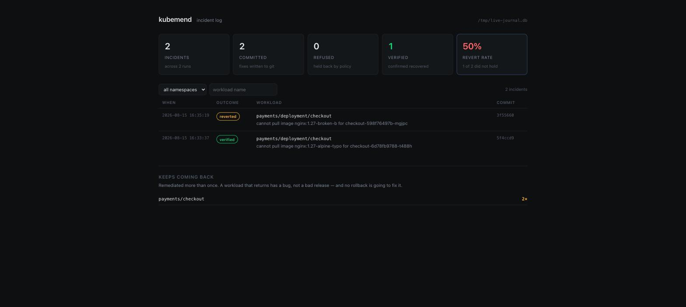

# kubemend


**A Kubernetes SRE agent whose only write surface is a git commit.**

Every AI SRE tool will read your cluster and tell you what it thinks is wrong. Almost none of them are trusted to *act*, and the reason is not model quality. It is that nobody has a convincing answer to "what stops it doing something catastrophic at 3am," and "the model is usually careful" is not an answer.

kubemend is an attempt at the answer. It diagnoses freely and acts narrowly, and every constraint on it is code with tests rather than a prompt.

```
    ✓ APPLY    payments/deployment/checkout
        restored clusters/prod/checkout.yaml to 808ce5f3
        commit bea2ee38 on main
        -          image: nginx:1.27-alpine-typo   # known good
        +          image: nginx:1.27-alpine   # known good

    ✓ PROPOSE  payments/deployment/api
        spec.template.spec.containers.api.resources.limits.memory: 256Mi -> 512Mi
        commit 0efe9c6 on kubemend/payments-api

    ✗ REFUSED  kube-system/deployment/coredns
        · kube-system is protected
```

It has no cluster credentials and issues no write to the Kubernetes API. It reads the cluster, edits a manifest in your GitOps repository, and commits; the reconciler you already run does the rest. Undoing it is `git revert`.

## Watch it work

One command, on a throwaway cluster. Needs `k3d`, `kubectl`, and a running Docker daemon.

```bash
demo/run.sh
```

It stands up a k3d cluster and a git repository holding its manifests, applies the repository the way Argo CD or Flux would, ships a release that breaks, and then lets kubemend read the cluster and write the fix back. The full recorded output is in [`demo/transcript.txt`](demo/transcript.txt); the middle of it looks like this:

```
== 3. A release goes out, and it is wrong
   checkout-6d78fb9788-qpbmw  ImagePullBackOff
   checkout-7bbdcbc9b7-dcdb8  Running

== 4. kubemend reads the cluster (read-only)
    critical  payments/deployment/checkout       image_pull
              cannot pull image nginx:1.27-alpine-typo for checkout-6d78fb9788-qpbmw
      ✓ APPLY    payments/deployment/checkout

== 5. kubemend writes the fix to the repository
      ✓ APPLY    payments/deployment/checkout
          restored clusters/prod/checkout.yaml to 808ce5f3
          commit bea2ee38 on main
          -          image: nginx:1.27-alpine-typo   # known good
          +          image: nginx:1.27-alpine   # known good

== 7. The reconciler applies the repository, and the cluster recovers
   deployment "checkout" successfully rolled out
```

Then it does the harder half. With `--verify` it watches the workload after committing, and the demo's second scenario ships **two** bad releases in a row so that rolling back one is not enough:

```
== 8. Now a fix that does NOT work
      ✓ APPLY    payments/deployment/checkout
          restored clusters/prod/checkout.yaml to 09ca0413
          commit 3c102fc2 on main
          watching for recovery...
          still failing after 75s: cannot pull image nginx:1.27-broken-a
          reverted in e5c31937
    0 commit(s) written.

== 9. It withdrew its own change
   6ab284f Revert "rollback payments/deployment/checkout"
   3c102fc rollback payments/deployment/checkout
   5213ae4 bad release B
```

Then it prints what it now knows about itself:

```
== 10. What it knows about itself
    incidents   2
    committed   2
    verified    1
    revert rate 50%  (1 of 2 fixes did not hold)

  keeps coming back   a rollback is not going to fix these
      2x  payments/checkout
```

The agent never called the Kubernetes API to change anything. It read the cluster, committed a fix, watched, kept the one that worked and withdrew the one that did not — and the revert rate above is measured from those two outcomes rather than claimed. `kubectl apply` stands in for the reconciler you would already be running.

CI runs this same script against a real cluster on every push, because a project whose claim is "it works against a real cluster" should not prove it with mocks.

## Try it without a cluster

The repo ships a recorded snapshot of a cluster having a bad afternoon, so the analysis path runs with nothing installed.

```bash
pip install -e ".[dev]"
kubemend diagnose --snapshot fixtures/broken-cluster.json
kubemend policy          # what each shipped policy permits
```

Against a real cluster, using your existing kubeconfig and read-only verbs:

```bash
kubemend diagnose                       # all namespaces
kubemend diagnose -n payments           # one namespace
kubemend snapshot --out cluster.json    # record now, analyse later
```

## Writing the fix

The agent has no cluster credentials and makes no API calls. It edits a manifest in your GitOps repository and commits; Argo CD or Flux carries the change to the cluster. Everything the repository already gives you then applies to the agent for free — an audit trail, review before rollout, and a revert that is one command.

```bash
kubemend remediate --snapshot cluster.json --repo ~/gitops --dry-run
kubemend remediate --repo ~/gitops              # against a live cluster
```

```
    ✓ APPLY    payments/deployment/checkout
        restored clusters/prod/checkout.yaml to fee63e44
        commit fc5d427c on main
        -          image: reg.internal/checkout:2.4.0   # last known good
        +          image: reg.internal/checkout:2.3.0   # last known good

    ✓ PROPOSE  payments/deployment/api
        spec.template.spec.containers.api.resources.limits.memory: 256Mi -> 512Mi
        commit 0efe9c6 on kubemend/payments-api

    ✗ REFUSED  kube-system/deployment/coredns
        · kube-system is protected
```

Policy decides the destination, not just permission: a rollback trusted to `apply` commits to the mainline, a resource change held at `propose` becomes a branch to review, and a refused plan is never rendered at all.

### Rollback is a git operation

In a GitOps repository the manifest is the source of truth, so returning a workload to its previous revision means restoring the file to its previous committed state. Nothing is reconstructed — the prior version is in the history, byte for byte, comments and all. This falls out of the architecture rather than being engineered, and it is the strongest reason to route an agent's actions through git.

### The diff is one line

The obvious way to edit a manifest is to parse the YAML, mutate the object, and dump it back. That produces a correct file and a useless commit: the dumper rewrites the whole document, drops comments, reorders keys, and normalises quoting, so a reviewer sees three hundred changed lines when the change was one number.

The entire value of routing actions through git is that a human can read the diff before it reaches the cluster, so edits are surgical. Trailing comments survive, including the exact spacing before them.

### It refuses more than it writes

- **A workload with no manifest** is reported, never created.
- **A value that drifted** — the repo says something other than what the cluster reported — is left alone. Somebody changed it, and their change is not the agent's to discard.
- **A field that does not exist** is not added. Inventing a resource limit the author never wrote is a different kind of change from adjusting one that is there.
- **An action with no manifest representation**, such as a rolling restart, is refused with a reason rather than approximated.
- **A dirty working tree** blocks emission entirely, so an agent's commit never absorbs someone's in-progress edit.

Every commit carries the evidence that produced it — the findings, the reason, the blast radius, what was deliberately left alone — and ends with the line that matters: `Undo: git revert this commit.`

## Verifying the fix

A loop that stops at "committed" is half a loop: the agent acted on a diagnosis that may have been wrong, and until something checks, the cluster is in a state nobody has confirmed is an improvement.

```bash
kubemend remediate --repo ~/gitops --verify --verify-timeout 180
```

Recovery is defined narrowly — **the findings that motivated the change are gone, and no new critical finding has appeared on that workload.** Not "the pods are running", which is true moments before a crash loop starts. A workload must read clean **twice consecutively**, because a rollout looks briefly healthy as it begins.

Three outcomes, and only one of them undoes anything:

| Outcome | What it means | Reverts? |
|---|---|---|
| `recovered` | the motivating findings are gone | no |
| `still_failing` | they remain, or a new critical one appeared | **yes** |
| `indeterminate` | the cluster could not be read | no |

The last row is the one worth arguing about. Reverting on evidence of continued failure is right. Reverting because the API server was briefly unreachable would undo a fix that may have worked, on no evidence, turning a network blip into a second production change. **Silence is not success, but it is not failure either** — an unverifiable outcome stops and asks for a human, and a failed read even breaks the recovery streak rather than bridging two clean ones.

When it does revert, it uses `git revert` rather than a reset. The history of an automated system acting on production is worth keeping, and a reviewer should see both that it acted and that it withdrew.

## Opening a pull request

```bash
kubemend remediate --repo ~/gitops --pr
```

Plans held at `propose` push their branch and open a PR whose body is the commit message — evidence, reason, blast radius, and what was left alone. A repository with no remote, or a missing `gh`, is reported rather than treated as an error, since that is the normal case for a local checkout.

## The incident log

Every run answers *what is wrong now*. Some questions only a history can answer, and they are the ones that decide whether an agent like this deserves more autonomy:

```bash
kubemend log                         # everything, newest first
kubemend log -n payments             # one namespace
kubemend log -n payments --workload checkout   # one workload, over time
```

```
  incident log   /Users/you/.kubemend/journal.db

  2026-08-15 16:29  committed     payments/deployment/checkout
      container checkout is in CrashLoopBackOff after 8 restarts
  2026-08-15 16:29  refused       kube-system/deployment/coredns
      container coredns is in CrashLoopBackOff after 6 restarts

  totals   across 3 run(s)

    incidents   12
    committed   3
    refused     3
    verified    2
    revert rate 33%  (1 of 3 fixes did not hold)

  keeps coming back   a rollback is not going to fix these

      3x  payments/checkout
```

Two numbers there are worth more than the rest.

**Revert rate is the agent's own accuracy** — how often its fix failed to hold and it had to withdraw its own commit. It is the only honest input to the question "should this be allowed to `apply` rather than `propose`?", and a tool that quietly declined to measure it would be asking for trust it had not earned.

**Repeat offenders** are the workloads a rollback keeps papering over. Something that crash-loops every week does not have a bad release, it has a bug, and the log is what makes that visible instead of letting three successful rollbacks look like three successes.

Refusals are recorded too. Knowing what the agent *declined* to touch, and why, is as much a part of the audit trail as what it changed.

Storage is a SQLite file at `~/.kubemend/journal.db` — stdlib `sqlite3`, so the zero-dependency promise holds. Writes are append-only, and the log is never load-bearing: an unwritable journal degrades to a note in the output rather than failing the run, because losing the audit trail is not a reason to abandon a broken workload. Pass `--journal none` to turn it off, or `--journal <path>` to keep it elsewhere.

## The console

`kubemend log` answers a question you already knew to ask. The console is for the other mode — scanning a week of automated changes to production and stopping at the one that looks wrong.

```bash
kubemend serve            # http://127.0.0.1:8420
```



*Real output from `demo/run.sh`: two incidents on the same workload, one fix that held and one that did not.*

Every incident opens to the whole audit trail: the evidence it saw, the action it selected with **both** `before` and `after`, the commit, whether verification confirmed recovery, and the revert if it did not.

Three constraints shaped it, and they are worth stating because each one was a choice:

**It is read-only, structurally rather than by policy.** There are no write routes at all. The only write surface in this project is a git commit, and a dashboard with a "remediate now" button would quietly make that claim untrue.

**It binds to localhost.** The journal is an inventory of what is fragile in your cluster — workloads, images, namespaces, failure modes. `--host` exists for people who mean it, and says so on startup.

**It is stdlib only.** `http.server` over the same SQLite file. Installing a web framework to look at a local database would be a poor reason to break the dependency promise.

## The design

### Typed actions, not commands

An agent that emits shell commands or raw manifests has an unbounded action space. You cannot enumerate what it might do, you cannot compute the blast radius before it runs, and you cannot mechanically undo it. Every safety property you would want is unavailable in principle, not merely unimplemented.

So kubemend never emits commands. It selects from a **closed set of six typed actions**, and every action carries both the state it found and the state it intends. Three properties follow directly:

- **Reversible by construction.** An action holds `before` and `after`, so its inverse is a field swap. An action whose `before` could not be captured is refused up front, rather than discovered to be irreversible at rollback time.
- **Blast radius is computable before execution.** Every action declares the pods it disrupts, so a plan is measured and refused while it is still text.
- **Reviewable.** A typed action renders to a deterministic diff. A human reviewing a pull request sees a bounded change, not a prompt's output.

Adding an action kind is a security decision, not a feature decision.

### Three levels of autonomy, granted per action

Trust is earned per action class, mirroring the crawl/walk/run progression operations teams actually use:

| Level | What happens |
|---|---|
| `report` | Findings only. Nothing is proposed. |
| `propose` | A pull request, for human review. |
| `apply` | Committed to the GitOps branch unattended. |

Under the shipped conservative policy only **rollback** may apply unattended, because it moves a workload to a state that demonstrably ran in this cluster and its inverse is exact. Everything else waits for a human.

**A plan's autonomy is the minimum across its actions.** One action needing review holds back the whole plan, because applying the safe half of a plan that was reasoned about as a unit is frequently worse than applying none of it.

### What the gate enforces

Six properties, checked by a pure function with no model in the loop:

- Control-plane namespaces (`kube-system`, `argocd`, `flux-system`, …) are excluded outright, not guarded by a threshold. Touching them can remove the machinery that would let you recover.
- Only action kinds named in policy, everything else denied by default.
- Blast radius bounded on pods, workloads and namespaces — for the plan as a whole, since three individually harmless restarts are not a harmless change.
- No action without a computable undo.
- Flap protection: a cluster that has already needed several fixes this window is a human's problem, not a loop's.
- An unconfigured `Policy()` permits nothing. A permissive default here is the difference between a bounded assistant and an unsupervised process with cluster credentials.

Policy is data, not code, so the rules governing an autonomous system are themselves reviewable, diffable and revertible — the same property the agent's own actions are required to have.

### One plan per incident

An incident is something that happened to a service, and a responder handles them one at a time. Batching every unrelated problem into one change would trip every blast-radius limit at once and couple the fate of unrelated services. Separate plans are separately reviewable, appliable and revertible.

### Abstaining is a feature

On the shipped fixture, 13 findings become 4 plans and **5 findings produce no action at all.** A missing ConfigMap needs a value the agent has no business inventing. An unschedulable pod is a capacity decision. A container restarting for unclear reasons needs a human to read the logs. Reporting these clearly and stopping is the correct behaviour, and the tests assert it.

## Status

Detection, planning, the policy gate, GitOps emission, pull requests, post-change verification with auto-revert, the incident log and the console are implemented and tested (157 tests, no dependencies). CI runs the full loop against a real k3d cluster on every push. The planner is **deterministic today** — there is no model in it yet, and that is sequencing rather than limitation: the parts that must be trustworthy are code with tests, so when a model is added it correlates and explains rather than deciding what happens to your cluster.

Not yet built:
- A model layer for correlating findings and writing incident narrative
- StatefulSets, DaemonSets, Jobs; node-level and networking signals

## The write-up

**[srivatsa03.github.io/kubemend](https://srivatsa03.github.io/kubemend/)** — the argument in one page, with the gate's verdicts explorable and every number exported from this repository at build time.

## Documentation

| Document | What it covers |
|---|---|
| [`docs/THREAT-MODEL.md`](docs/THREAT-MODEL.md) | What can go wrong when an automated process changes production, what this design **prevents** versus **discourages**, and the twelve failure modes it was built against |
| [`docs/EVALUATION.md`](docs/EVALUATION.md) | Every measured number, the method behind it, and what has deliberately **not** been evaluated |
| [`docs/FINDINGS.md`](docs/FINDINGS.md) | Six engineering findings from building an agent that writes to production — reversibility as architecture, reviewability as a safety property, and why the accuracy number nobody publishes is the one that matters |
| [`docs/kubemend-report.pdf`](docs/kubemend-report.pdf) | The full write-up as a 13-page paper ([LaTeX source](docs/kubemend-report.tex), compiles on Overleaf) |

## Detection rules

| Rule | Severity | What it catches |
|---|---|---|
| `crashloop` | critical | Container the kubelet has given up restarting promptly |
| `oomkilled` | critical | Killed by the kernel for exceeding its memory limit |
| `image_pull` | critical | Bad tag, bad registry, or missing pull credentials |
| `config_error` | critical | References a ConfigMap or Secret that does not exist |
| `rollout_stuck` | critical | Rollout past its progress deadline |
| `replica_shortfall` | critical / warning | Fewer replicas available than desired |
| `unschedulable` | warning | No node can fit the pod |
| `flapping` | warning | Restarting repeatedly while still reporting healthy |

`flapping` is the one worth calling out: the pod is up, dashboards are green, nothing pages, and it has died eleven times today. That is the failure mode most likely to survive unnoticed for weeks.

## License

Apache-2.0
